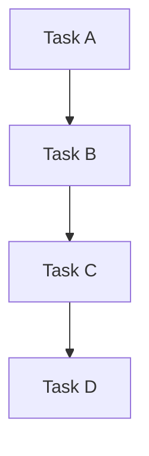

# Implementation Tasks Template

## Quality Assessment

**Generated**: [Number] Features  
**AI autonomous execution confidence**: [Score]/10  
**Reason**: [Explanation of confidence score and potential issues]

## Implementation Overview

Brief description of the overall system and implementation strategy.

## Task Categories

### Phase 1: Foundation Setup
- [ ] **Task 1**: Description
  - **PRP**: Link to PRP
  - **Priority**: High/Medium/Low
  - **Dependencies**: List of dependencies

### Phase 2: Core Implementation  
- [ ] **Task 2**: Description
  - **PRP**: Link to PRP
  - **Priority**: High/Medium/Low
  - **Dependencies**: List of dependencies

### Phase 3: Integration & Testing
- [ ] **Task 3**: Description
  - **PRP**: Link to PRP
  - **Priority**: High/Medium/Low
  - **Dependencies**: List of dependencies

### Phase 4: Deployment & Validation
- [ ] **Task 4**: Description
  - **PRP**: Link to PRP
  - **Priority**: High/Medium/Low
  - **Dependencies**: List of dependencies

## Dependencies Map

## Risk Assessment

### High Risk Items
- **Risk 1**: Description and mitigation strategy
- **Risk 2**: Description and mitigation strategy

### Medium Risk Items
- **Risk 3**: Description and mitigation strategy

## Success Criteria

- [ ] Criterion 1: Measurable outcome
- [ ] Criterion 2: Measurable outcome
- [ ] Criterion 3: Measurable outcome

## Monitoring & Validation

### Testing Strategy, if applicable
- Unit testing approach
- Integration testing approach  
- Performance testing approach

### Quality Gates, if applicable
- Code quality requirements
- Performance benchmarks
- Security validation steps