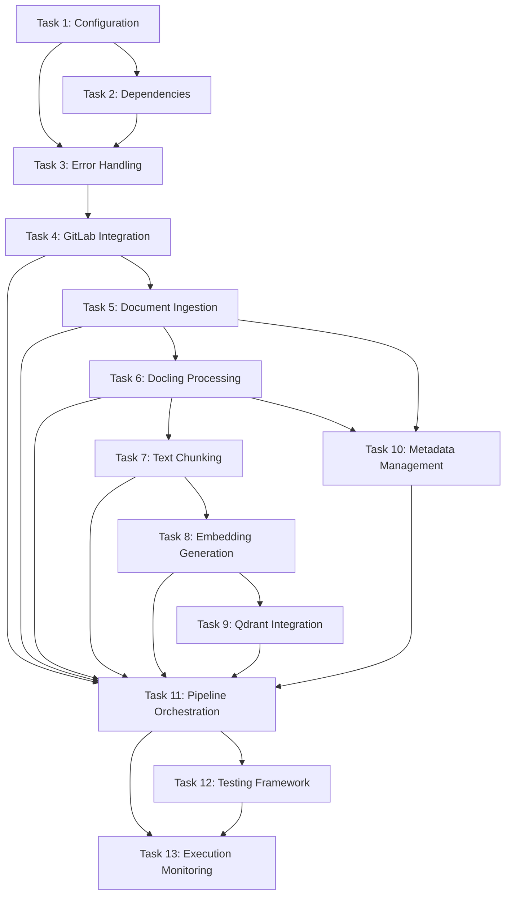

# Implementation Tasks

## Quality Assessment

**Generated**: 10 Features  
**AI autonomous execution confidence**: 8/10  
**Reason**: Comprehensive PRPs with detailed implementation specifications. Minor risks include dependency management for specialized libraries (Docling) and network connectivity requirements. All technical decisions are documented with fallback strategies.

## Implementation Overview

The NIC ETL pipeline is a production-ready Jupyter Notebook that implements a complete document processing workflow from GitLab repository ingestion to Qdrant vector database storage. The system processes official NIC documents through OCR, structure extraction, chunking, embedding generation, and semantic storage with comprehensive metadata management.

**Architecture**: Modular Jupyter Notebook with 12 cells implementing distinct processing stages  
**Technology Stack**: Python, Docling, BAAI/bge-m3, Qdrant, GitLab API  
**Processing Flow**: GitLab → Ingestion → Docling → Chunking → Embeddings → Qdrant  
**Key Features**: OCR processing, semantic chunking, multilingual embeddings, metadata compliance

## Task Categories

### Phase 1: Foundation Setup

- [ ] **Task 1**: Environment Configuration Setup
  - **PRP**: [configuration-management.md](./configuration-management.md)
  - **Priority**: High
  - **Dependencies**: None
  - **Description**: Implement Cell 1 configuration management with .env support, environment detection, and validation

- [ ] **Task 2**: Dependencies Installation and Core Imports
  - **PRP**: [configuration-management.md](./configuration-management.md)
  - **Priority**: High
  - **Dependencies**: Task 1
  - **Description**: Implement Cell 2 with all required dependencies, version management, and import validation

- [ ] **Task 3**: Error Handling and Monitoring Framework
  - **PRP**: [error-handling.md](./error-handling.md)
  - **Priority**: High
  - **Dependencies**: Task 1, Task 2
  - **Description**: Implement comprehensive error handling, logging, and health monitoring across all components

### Phase 2: Core Implementation

- [ ] **Task 4**: GitLab Integration Implementation
  - **PRP**: [gitlab-integration.md](./gitlab-integration.md)
  - **Priority**: High
  - **Dependencies**: Task 1, Task 3
  - **Description**: Implement Cell 3 GitLab client with authentication, file listing, downloading, and caching

- [ ] **Task 5**: Document Ingestion System
  - **PRP**: [document-ingestion.md](./document-ingestion.md)
  - **Priority**: High
  - **Dependencies**: Task 4
  - **Description**: Implement Cell 4 document management with format detection, validation, and state tracking

- [ ] **Task 6**: Docling Processing Engine
  - **PRP**: [docling-processing.md](./docling-processing.md)
  - **Priority**: High
  - **Dependencies**: Task 5
  - **Description**: Implement Cell 5 Docling processor with OCR detection, structure extraction, and quality assessment

- [ ] **Task 7**: Text Chunking Strategy
  - **PRP**: [text-chunking.md](./text-chunking.md)
  - **Priority**: High
  - **Dependencies**: Task 6
  - **Description**: Implement Cell 6 chunking with BGE-M3 tokenizer, paragraph-based strategy, and overlap management

- [ ] **Task 8**: Embedding Generation System
  - **PRP**: [embedding-generation.md](./embedding-generation.md)
  - **Priority**: High
  - **Dependencies**: Task 7
  - **Description**: Implement Cell 7 BGE-M3 embedding generation with CPU optimization and caching

### Phase 3: Integration & Storage

- [ ] **Task 9**: Qdrant Vector Database Integration
  - **PRP**: [qdrant-integration.md](./qdrant-integration.md)
  - **Priority**: High
  - **Dependencies**: Task 8
  - **Description**: Implement Cell 8 Qdrant client with collection management, vector insertion, and search capabilities

- [ ] **Task 10**: Metadata Management (NIC Schema)
  - **PRP**: [metadata-management.md](./metadata-management.md)
  - **Priority**: Medium
  - **Dependencies**: Task 5, Task 6
  - **Description**: Implement Cell 9 NIC schema compliance, validation, and enrichment

- [ ] **Task 11**: Pipeline Orchestration
  - **PRP**: [pipeline-orchestration.md](./pipeline-orchestration.md)
  - **Priority**: High
  - **Dependencies**: Task 4-10
  - **Description**: Implement Cell 10 pipeline coordinator with stage management, error recovery, and monitoring

### Phase 4: Testing & Validation

- [ ] **Task 12**: Testing and Validation Framework
  - **PRP**: Multiple PRPs (testing sections)
  - **Priority**: Medium
  - **Dependencies**: Task 11
  - **Description**: Implement Cell 11 comprehensive testing suite with unit, integration, and performance tests

- [ ] **Task 13**: Pipeline Execution and Monitoring
  - **PRP**: [pipeline-orchestration.md](./pipeline-orchestration.md), [error-handling.md](./error-handling.md)
  - **Priority**: Medium
  - **Dependencies**: Task 11, Task 12
  - **Description**: Implement Cell 12 main execution with progress tracking, metrics collection, and report generation

## Dependencies Map

## Risk Assessment

### High Risk Items
- **Docling Library Compatibility**: Docling is a specialized library that may have specific version requirements or installation challenges
  - **Mitigation**: Implement fallback OCR strategies, test installation in target environment early
- **Network Connectivity Dependencies**: GitLab and Qdrant require reliable network access
  - **Mitigation**: Implement retry logic, offline mode for development, connection pooling
- **Memory Management with Large Documents**: Processing large PDFs and generating embeddings may cause memory issues
  - **Mitigation**: Implement streaming processing, batch size optimization, memory monitoring

### Medium Risk Items
- **BGE-M3 Model Download**: Large model download may fail or be slow in some environments
  - **Mitigation**: Implement model caching, provide alternative download methods
- **Qdrant Collection Configuration**: Incorrect vector dimensions or distance metrics could require recreation
  - **Mitigation**: Implement configuration validation, collection backup/restore procedures
- **Token Limit Handling**: Documents exceeding model token limits need special handling
  - **Mitigation**: Implement dynamic chunking, token counting validation

## Success Criteria

- [ ] **Criterion 1**: Complete document processing pipeline from GitLab to Qdrant with >95% success rate
- [ ] **Criterion 2**: Processing speed of >100 documents per hour on standard hardware
- [ ] **Criterion 3**: Embedding quality validation with cosine similarity >0.8 for related documents
- [ ] **Criterion 4**: NIC Schema compliance with 100% metadata validation
- [ ] **Criterion 5**: Error recovery and restart capability without data loss
- [ ] **Criterion 6**: Comprehensive logging and monitoring with real-time status visibility
- [ ] **Criterion 7**: Production deployment readiness with environment-specific configuration
- [ ] **Criterion 8**: Idempotent processing preventing duplicate records in Qdrant

## Monitoring & Validation

### Testing Strategy
- **Unit Testing**: Each cell/component tested independently with mock data
- **Integration Testing**: End-to-end pipeline testing with sample documents
- **Performance Testing**: Load testing with large document collections
- **Quality Testing**: Embedding quality validation and similarity testing
- **Failure Testing**: Error injection and recovery validation

### Quality Gates
- **Code Quality**: All functions documented, error handling implemented
- **Performance Benchmarks**: <10 seconds per page processing, <5GB memory usage
- **Security Validation**: Credential protection, input validation, secure communication
- **Documentation Completeness**: All configuration options documented, usage examples provided

## Implementation Notes

### Cell Structure
The implementation follows the specified 12-cell Jupyter Notebook structure:
1. **Cell 1**: Environment Configuration and Constants
2. **Cell 2**: Dependencies Installation and Imports  
3. **Cell 3**: GitLab Connection and Authentication Functions
4. **Cell 4**: Document Retrieval and Caching Functions
5. **Cell 5**: Docling Processing and OCR Functions
6. **Cell 6**: Text Chunking Functions
7. **Cell 7**: Embedding Generation Functions
8. **Cell 8**: Qdrant Integration Functions
9. **Cell 9**: Metadata Management (NIC Schema)
10. **Cell 10**: Main Pipeline Orchestration
11. **Cell 11**: Testing and Validation Functions
12. **Cell 12**: Pipeline Execution and Monitoring

### Key Implementation Considerations
- **Production-Ready**: All code designed for production use with comprehensive error handling
- **Self-Contained**: No external .py files, everything within notebook cells
- **Environment-Agnostic**: Same notebook works across dev/staging/production with configuration changes
- **Idempotent**: Safe to re-run without creating duplicates
- **Monitored**: Comprehensive logging and health monitoring throughout

### Technical Specifications
- **Document Formats**: TXT, MD, PDF, DOCX, JPG, PNG
- **Embedding Model**: BAAI/bge-m3 (1024 dimensions)
- **Chunking Strategy**: 500 tokens with 100 token overlap
- **Vector Database**: Qdrant with cosine similarity
- **Languages**: Portuguese and English support
- **Processing**: CPU-based with optimization for production deployment