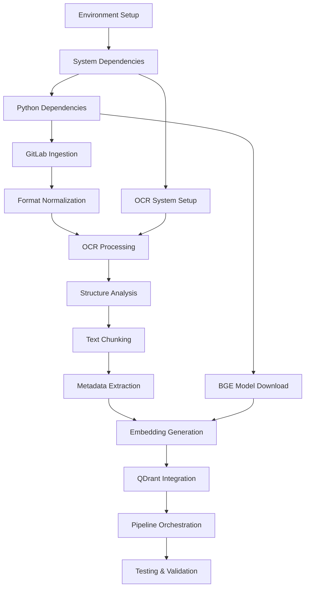

# NIC ETL Implementation Tasks

## Quality Assessment

**Generated**: 8 Features  
**Examples created**: 8 comprehensive PRPs with ROMCIVA framework, code templates, validation strategies  
**Modules documented**: GitLab ingestion, Document normalization, OCR processing, Structure analysis, Text chunking, Metadata extraction, Embedding generation, QDrant integration  
**Autonomous execution confidence**: 8/10  
**Reason**: Comprehensive specifications with detailed implementation blueprints, clear dependencies, and executable validation criteria. Minor concerns include external library version compatibility and system-level OCR dependencies that may require additional setup verification.

## Implementation Overview

The NIC ETL system processes documents from GitLab repositories through a sophisticated pipeline that extracts, transforms, and loads content into a vector database for semantic search. The implementation follows a modular architecture with 8 specialized components, each handling a specific aspect of document processing from ingestion to vector storage.

**Architecture Flow**: GitLab → Format Normalization → OCR (if needed) → Structure Analysis → Text Chunking → Metadata Extraction → Embedding Generation → QDrant Storage

## Task Categories

### Phase 1: Environment Setup & Core Infrastructure (Estimated: 2-3 days)

- [ ] **Task 1.1**: Development Environment Setup
  - **PRP**: Foundation for all components
  - **Priority**: High
  - **Estimated Time**: 4 hours
  - **Dependencies**: None
  - **Details**: 
    - Set up Python 3.8+ virtual environment
    - Install Jupyter notebook/lab
    - Configure development tools (git, IDE)

- [ ] **Task 1.2**: Install System Dependencies
  - **PRP**: OCR Processing System
  - **Priority**: High  
  - **Estimated Time**: 3 hours
  - **Dependencies**: Task 1.1
  - **Details**:
    - Install Tesseract OCR engine
    - Install OCRmyPDF and Poppler utilities
    - Configure Portuguese language packs
    - Test OCR functionality

- [ ] **Task 1.3**: Install Python Dependencies
  - **PRP**: All components
  - **Priority**: High
  - **Estimated Time**: 2 hours  
  - **Dependencies**: Task 1.1
  - **Details**:
    - Create requirements.txt with all necessary packages
    - Install transformers, qdrant-client, python-gitlab, docling
    - Download and cache BGE-M3 model (~4GB)
    - Verify all imports and basic functionality

### Phase 2: Data Ingestion & Processing Foundation (Estimated: 3-4 days)

- [ ] **Task 2.1**: Implement GitLab Document Ingestion
  - **PRP**: [GitLab Document Ingestion](./gitlab-document-ingestion.md)
  - **Priority**: High
  - **Estimated Time**: 6 hours
  - **Dependencies**: Task 1.3
  - **Details**:
    - Implement GitLabDocumentCollector class
    - Add authentication and connection handling
    - Create file collection and metadata extraction
    - Test with actual GitLab repository

- [ ] **Task 2.2**: Implement Document Format Normalization  
  - **PRP**: [Document Format Normalization](./document-format-normalization.md)
  - **Priority**: High
  - **Estimated Time**: 8 hours
  - **Dependencies**: Task 2.1
  - **Details**:
    - Implement FormatDetector for PDF/DOCX/image detection
    - Create PDFProcessor and DOCXProcessor classes
    - Build DocumentNormalizer orchestrator
    - Test with various document formats

- [ ] **Task 2.3**: Implement OCR Processing System
  - **PRP**: [OCR Processing System](./ocr-processing-system.md)  
  - **Priority**: High
  - **Estimated Time**: 10 hours
  - **Dependencies**: Task 1.2, Task 2.2
  - **Details**:
    - Implement ScanDetector for scanned document identification
    - Create ImagePreprocessor for image enhancement
    - Build TesseractProcessor with Portuguese support
    - Integrate OCRmyPDF for PDF processing
    - Implement OCRQualityAssessor for validation

### Phase 3: Document Analysis & Structure (Estimated: 2-3 days)

- [ ] **Task 3.1**: Implement Document Structure Analysis
  - **PRP**: [Document Structure Analysis](./document-structure-analysis.md)
  - **Priority**: Medium
  - **Estimated Time**: 8 hours
  - **Dependencies**: Task 2.3
  - **Details**:
    - Integrate docling library for structure extraction
    - Implement DocumentStructureAnalyzer class
    - Build hierarchy extraction and validation
    - Create StructureOutputFormatter for chunking pipeline

- [ ] **Task 3.2**: Implement Text Chunking Engine  
  - **PRP**: [Text Chunking Engine](./text-chunking-engine.md)
  - **Priority**: High
  - **Estimated Time**: 10 hours
  - **Dependencies**: Task 3.1, BGE tokenizer
  - **Details**:
    - Implement BGETokenizer wrapper for accurate token counting
    - Create ParagraphChunker with 500-token chunks and 100-token overlap
    - Build OverlapManager for context preservation
    - Implement chunk quality assessment and statistics

- [ ] **Task 3.3**: Implement Metadata Extraction System
  - **PRP**: [Metadata Extraction System](./metadata-extraction-system.md)
  - **Priority**: Medium
  - **Estimated Time**: 8 hours  
  - **Dependencies**: Task 3.2
  - **Details**:
    - Create NICSchemaValidator for metadata compliance
    - Implement DocumentMetadataExtractor with NIC Schema
    - Build SectionMetadataGenerator and LineageTracker
    - Create MetadataEnricher for chunk enrichment

### Phase 4: AI Processing & Vector Storage (Estimated: 3-4 days)

- [ ] **Task 4.1**: Implement Embedding Generation
  - **PRP**: [Embedding Generation](./embedding-generation.md)
  - **Priority**: High
  - **Estimated Time**: 10 hours
  - **Dependencies**: Task 3.3, BGE-M3 model
  - **Details**:
    - Implement BGEM3EmbeddingModel wrapper for local CPU inference
    - Create EmbeddingTextPreprocessor for optimal input preparation  
    - Build BatchEmbeddingProcessor for efficient processing
    - Implement EmbeddingQualityValidator for output validation

- [ ] **Task 4.2**: Implement QDrant Vector Database Integration
  - **PRP**: [QDrant Vector Database Integration](./qdrant-vector-database-integration.md)
  - **Priority**: High
  - **Estimated Time**: 10 hours
  - **Dependencies**: Task 4.1, QDrant access
  - **Details**:
    - Implement QdrantClientWrapper with retry mechanisms
    - Create CollectionManager for collection lifecycle
    - Build DataUploader with stable ID generation
    - Implement QdrantSearchInterface for semantic search

### Phase 5: Integration & Pipeline Orchestration (Estimated: 2-3 days)

- [ ] **Task 5.1**: Create Main Jupyter Notebook
  - **PRP**: All components integration
  - **Priority**: High
  - **Estimated Time**: 6 hours
  - **Dependencies**: All previous tasks
  - **Details**:
    - Create comprehensive Jupyter notebook with all pipeline steps
    - Implement error handling and progress tracking
    - Add configuration management and parameter tuning
    - Create pipeline statistics and monitoring

- [ ] **Task 5.2**: Implement Pipeline Orchestration
  - **PRP**: System integration
  - **Priority**: Medium
  - **Estimated Time**: 4 hours
  - **Dependencies**: Task 5.1
  - **Details**:
    - Create NICETLOrchestrator class to coordinate all components
    - Implement pipeline state management and checkpointing
    - Add resume functionality for interrupted processing
    - Build comprehensive logging and monitoring

### Phase 6: Testing & Validation (Estimated: 2-3 days)

- [ ] **Task 6.1**: Unit Testing Implementation
  - **PRP**: All components
  - **Priority**: Medium
  - **Estimated Time**: 8 hours
  - **Dependencies**: Task 5.2
  - **Details**:
    - Implement unit tests for each component class
    - Create test fixtures and mock data
    - Set up pytest configuration and test automation
    - Achieve >80% code coverage

- [ ] **Task 6.2**: Integration Testing & Validation
  - **PRP**: End-to-end pipeline
  - **Priority**: High
  - **Estimated Time**: 6 hours
  - **Dependencies**: Task 6.1
  - **Details**:
    - Test complete pipeline with sample documents
    - Validate embedding quality and search functionality
    - Performance testing with larger document sets
    - Error handling and edge case validation

- [ ] **Task 6.3**: Documentation & User Guide
  - **PRP**: System documentation  
  - **Priority**: Medium
  - **Estimated Time**: 4 hours
  - **Dependencies**: Task 6.2
  - **Details**:
    - Create comprehensive usage documentation
    - Write troubleshooting guide
    - Document configuration options and parameters
    - Create examples and tutorials

## Dependencies Map

## Risk Assessment

### High Risk Items
- **BGE-M3 Model Compatibility**: The 4GB model download and local CPU inference may face performance or compatibility issues
  - **Mitigation**: Test model loading early, have fallback embedding strategies, consider cloud API alternatives
- **OCR System Dependencies**: Tesseract and related tools require system-level installation that may vary by environment
  - **Mitigation**: Provide detailed installation instructions, Docker containerization option, automated setup scripts
- **QDrant API Integration**: External dependency on hosted QDrant service with specific credentials
  - **Mitigation**: Environment variable configuration, connection testing, backup storage options

### Medium Risk Items  
- **Document Format Variations**: Real-world documents may have formats not covered in testing
  - **Mitigation**: Extensive format testing, graceful error handling, format expansion capability
- **Memory Usage with Large Documents**: Processing large document sets may exceed memory limits
  - **Mitigation**: Streaming processing, batch size optimization, memory monitoring and cleanup
- **Processing Performance**: CPU-based processing may be too slow for large document volumes
  - **Mitigation**: Performance profiling, optimization opportunities, parallel processing options

## Success Criteria

- [ ] **Functional Completeness**: Successfully process 95%+ of documents from GitLab repository (30-Aprovados folder)
- [ ] **Processing Quality**: Achieve >90% OCR accuracy, >95% chunk quality scores, and >85% metadata extraction confidence  
- [ ] **Performance Targets**: Process 100+ documents per hour, generate embeddings at >100 chunks/minute, maintain <2GB memory usage
- [ ] **Search Functionality**: Enable semantic search with <100ms response times and >80% relevance for business queries
- [ ] **Data Integrity**: Maintain 100% consistency between processed documents and stored vectors with stable ID generation
- [ ] **Pipeline Reliability**: Handle errors gracefully with <1% data loss rate and comprehensive logging for troubleshooting

## Monitoring & Validation

### Testing Strategy
- **Unit Testing**: Each component class tested independently with mocked dependencies and edge cases
- **Integration Testing**: End-to-end pipeline validation with sample documents covering various formats and complexities  
- **Performance Testing**: Batch processing validation, memory usage monitoring, and throughput measurement under load

### Quality Gates
- **Code Quality**: All components pass linting, follow consistent patterns, include comprehensive error handling
- **Performance Benchmarks**: Meet processing speed targets, memory usage limits, and search response time requirements
- **Security Validation**: Secure credential handling, input sanitization, audit logging for all operations

### Validation Checklist
- [ ] All 8 components successfully integrated and communicating
- [ ] Sample documents processed end-to-end with quality validation
- [ ] QDrant collection populated with searchable embeddings
- [ ] Performance metrics meet specified targets
- [ ] Error handling covers identified edge cases
- [ ] Documentation complete and tested with new users