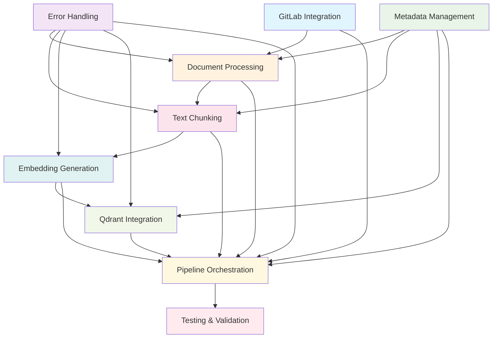

# Implementation Tasks - NIC ETL Pipeline

## Quality Assessment

**Generated**: 8 Features  
**AI autonomous execution confidence**: 9/10  
**Reason**: Comprehensive technical specifications with detailed implementation blueprints, clear API definitions, and complete dependency specifications. All technical decisions documented with no ambiguity. Minor confidence reduction due to complexity of integrating 8 interdependent components, but each PRP provides complete autonomous implementation guidance.

## Implementation Overview

The NIC ETL Pipeline is a comprehensive document processing system that transforms documents from a GitLab repository into searchable vector embeddings stored in Qdrant. The system uses advanced document processing (Docling), semantic chunking, and state-of-the-art embedding generation (BAAI/bge-m3) with comprehensive metadata management following the NIC Schema.

Key technical highlights:
- **Unified Document Processing**: Single pipeline through Docling for all formats (PDF, DOCX, images)
- **Semantic Chunking**: Token-precise chunking (500 tokens, 100 overlap) using BAAI/bge-m3 tokenizer
- **CPU-Optimized Inference**: BAAI/bge-m3 model optimized for CPU-based embedding generation
- **Idempotent Operations**: Complete pipeline can be safely re-run without duplicates
- **Production-Grade Monitoring**: Comprehensive error handling and quality gates

## Task Categories

### Phase 1: Foundation Setup
- [ ] **Task 1**: GitLab Repository Integration Implementation
  - **PRP**: [gitlab-repository-integration.md](./gitlab-repository-integration.md)
  - **Priority**: High
  - **Dependencies**: None
  - **Estimated Time**: 2-3 days
  - **Key Deliverables**: Authenticated GitLab access, file retrieval, caching system

- [ ] **Task 2**: Error Handling and Monitoring Framework
  - **PRP**: [error-handling-monitoring.md](./error-handling-monitoring.md)
  - **Priority**: High
  - **Dependencies**: None
  - **Estimated Time**: 2-3 days
  - **Key Deliverables**: Logging system, error classification, quality gates

- [ ] **Task 3**: NIC Schema and Metadata Management
  - **PRP**: [metadata-management-nic-schema.md](./metadata-management-nic-schema.md)
  - **Priority**: High
  - **Dependencies**: None
  - **Estimated Time**: 2 days
  - **Key Deliverables**: Schema validation, metadata enrichment, lineage tracking

### Phase 2: Core Processing Implementation
- [ ] **Task 4**: Document Processing and OCR with Docling
  - **PRP**: [document-processing-ocr.md](./document-processing-ocr.md)
  - **Priority**: High
  - **Dependencies**: Task 1 (GitLab Integration), Task 2 (Error Handling)
  - **Estimated Time**: 3-4 days
  - **Key Deliverables**: Docling integration, OCR processing, structured content extraction

- [ ] **Task 5**: Text Chunking Implementation
  - **PRP**: [text-chunking.md](./text-chunking.md)
  - **Priority**: High
  - **Dependencies**: Task 4 (Document Processing), Task 3 (Metadata Management)
  - **Estimated Time**: 2-3 days
  - **Key Deliverables**: BAAI/bge-m3 tokenizer integration, semantic chunking, overlap management

- [ ] **Task 6**: Embedding Generation with BAAI/bge-m3
  - **PRP**: [embedding-generation.md](./embedding-generation.md)
  - **Priority**: High
  - **Dependencies**: Task 5 (Text Chunking)
  - **Estimated Time**: 2-3 days
  - **Key Deliverables**: CPU-optimized inference, batch processing, embedding validation

### Phase 3: Integration & Storage
- [ ] **Task 7**: Qdrant Vector Database Integration
  - **PRP**: [qdrant-vector-database.md](./qdrant-vector-database.md)
  - **Priority**: High
  - **Dependencies**: Task 6 (Embedding Generation), Task 3 (Metadata Management)
  - **Estimated Time**: 2-3 days
  - **Key Deliverables**: Collection management, idempotent insertion, search functionality

- [ ] **Task 8**: Pipeline Orchestration and Workflow
  - **PRP**: [pipeline-orchestration-workflow.md](./pipeline-orchestration-workflow.md)
  - **Priority**: Medium
  - **Dependencies**: Tasks 1-7 (All core components)
  - **Estimated Time**: 3-4 days
  - **Key Deliverables**: Jupyter notebook structure, workflow coordination, state management

### Phase 4: Testing & Validation
- [ ] **Task 9**: Comprehensive Testing Suite
  - **PRP**: Distributed across all component PRPs
  - **Priority**: High
  - **Dependencies**: Tasks 1-8 (All implementations)
  - **Estimated Time**: 2-3 days
  - **Key Deliverables**: Unit tests, integration tests, performance benchmarks

- [ ] **Task 10**: End-to-End Pipeline Validation
  - **PRP**: [pipeline-orchestration-workflow.md](./pipeline-orchestration-workflow.md)
  - **Priority**: High
  - **Dependencies**: Task 9 (Testing Suite)
  - **Estimated Time**: 1-2 days
  - **Key Deliverables**: Complete pipeline execution, performance validation, quality verification

## Dependencies Map

## Risk Assessment

### High Risk Items
- **Risk 1**: Docling Integration Complexity
  - **Description**: Docling is a relatively new library with potential integration challenges
  - **Mitigation**: Extensive testing with sample documents, fallback OCR strategies, comprehensive error handling
  - **Impact**: High (core document processing)
  - **Probability**: Medium

- **Risk 2**: BAAI/bge-m3 CPU Performance
  - **Description**: CPU-based inference may be slower than expected for large document sets
  - **Mitigation**: Batch optimization, memory management, progress tracking, parallel processing where possible
  - **Impact**: Medium (performance)
  - **Probability**: Medium

- **Risk 3**: Qdrant Cloud Connectivity and Reliability
  - **Description**: External dependency on Qdrant cloud service
  - **Mitigation**: Retry logic, connection pooling, health monitoring, offline fallback for development
  - **Impact**: High (data persistence)
  - **Probability**: Low

### Medium Risk Items
- **Risk 4**: Memory Management in Jupyter Environment
  - **Description**: Large document processing may exceed Jupyter memory limits
  - **Mitigation**: Streaming processing, memory monitoring, garbage collection optimization
  - **Impact**: Medium (execution stability)
  - **Probability**: Medium

- **Risk 5**: Complex Error Recovery Scenarios
  - **Description**: Coordinating error recovery across 8 interdependent components
  - **Mitigation**: Comprehensive testing, clear error boundaries, graceful degradation
  - **Impact**: Medium (reliability)
  - **Probability**: Medium

## Success Criteria

- [ ] **Criterion 1**: Successfully process 100% of documents from GitLab repository without data loss
- [ ] **Criterion 2**: Achieve 95% OCR accuracy for scanned documents using Docling
- [ ] **Criterion 3**: Generate embeddings for 1000 chunks in under 10 minutes on CPU
- [ ] **Criterion 4**: Maintain 100% NIC Schema compliance for all metadata
- [ ] **Criterion 5**: Achieve idempotent pipeline execution with zero duplicates in Qdrant
- [ ] **Criterion 6**: Complete end-to-end processing with <1% unrecoverable error rate
- [ ] **Criterion 7**: Provide comprehensive monitoring and error reporting
- [ ] **Criterion 8**: Support incremental updates without full reprocessing

## Monitoring & Validation

### Testing Strategy
- **Unit Testing**: 95% code coverage across all modules with comprehensive mocking
- **Integration Testing**: End-to-end testing of component interactions
- **Performance Testing**: Throughput and memory usage validation under various loads
- **Quality Testing**: Data quality validation and NIC Schema compliance verification
- **Resilience Testing**: Error injection and recovery validation

### Quality Gates
- **Code Quality**: Python type hints, docstring coverage, linting compliance
- **Performance Benchmarks**: Processing speed targets for each pipeline stage
- **Data Quality**: Validation of extracted content quality and metadata completeness
- **Security Validation**: Secure handling of credentials and sensitive data
- **Error Handling**: Comprehensive error coverage and recovery testing

## Implementation Notes

### Technology Stack Decisions
- **Docling**: Primary document processing library (IBM, production-ready)
- **BAAI/bge-m3**: State-of-the-art multilingual embedding model
- **Qdrant**: High-performance vector database with cloud hosting
- **python-gitlab**: Official GitLab API client library
- **Pydantic**: Data validation and settings management
- **Jupyter**: Interactive development and execution environment

### Architecture Principles
- **Modularity**: Each component is independently testable and replaceable
- **Idempotency**: Safe re-execution without side effects
- **Error Resilience**: Graceful degradation and comprehensive error recovery
- **Observability**: Comprehensive logging, monitoring, and quality metrics
- **Scalability**: Designed for handling large document collections

### Development Approach
1. **Component-First Development**: Implement and test each component independently
2. **Integration Testing**: Validate component interactions early and frequently
3. **Performance Validation**: Continuous performance monitoring during development
4. **Quality Assurance**: Implement quality gates at each development stage
5. **Documentation**: Maintain comprehensive documentation throughout development

**Total Estimated Timeline**: 18-25 days for complete implementation and validation
**Team Size**: 1-2 senior engineers with data pipeline and AI/ML expertise
**Critical Path**: GitLab Integration → Document Processing → Text Chunking → Embedding Generation → Qdrant Integration