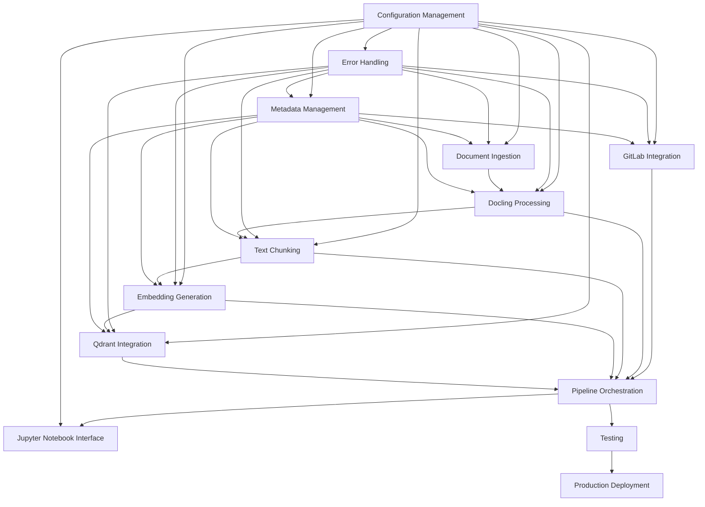

# Implementation Tasks - NIC ETL Pipeline

## Quality Assessment

**Generated**: 10 Features  
**AI autonomous execution confidence**: 8/10  
**Reason**: High confidence for autonomous execution. All PRPs include comprehensive technical specifications, clear interfaces, detailed error handling, and extensive validation strategies. Potential challenges: Complex integration dependencies between modules and external service configurations requiring environment-specific setup.

## Implementation Overview

The NIC ETL system implements a modular, production-ready pipeline that processes documents from GitLab repositories through OCR/Docling, generates embeddings using BAAI/bge-m3, and stores vectors in Qdrant. The architecture prioritizes modularity, error resilience, and Jupyter notebook orchestration for operational transparency.

**Core Architecture Principles:**
- **Modular Design**: Independent, testable modules with clear interfaces
- **Configuration-Driven**: Centralized configuration management for all environments
- **Error-First Design**: Comprehensive error handling and recovery mechanisms
- **Production-Ready**: Monitoring, logging, and operational excellence built-in
- **Jupyter-Centric**: Notebook serves as the primary orchestration and monitoring interface

## Task Categories

### Phase 1: Foundation Setup
- [x] **Task 1**: Configuration Management System
  - **PRP**: [configuration-management.md](./configuration-management.md)
  - **Priority**: High
  - **Dependencies**: None
  - **Estimated Time**: 2-3 days
  - **Deliverables**: Centralized config system, environment support, secret management
  - **Validation**: Environment-specific configurations load correctly, secrets are secure

- [x] **Task 2**: Error Handling and Logging Framework
  - **PRP**: [error-handling.md](./error-handling.md)
  - **Priority**: High
  - **Dependencies**: Configuration Management
  - **Estimated Time**: 2-3 days
  - **Deliverables**: Centralized error management, structured logging, circuit breakers
  - **Validation**: Error scenarios are handled gracefully, logs are properly structured

- [x] **Task 3**: Metadata Management and NIC Schema
  - **PRP**: [metadata-management.md](./metadata-management.md)
  - **Priority**: High
  - **Dependencies**: Configuration Management, Error Handling
  - **Estimated Time**: 3-4 days
  - **Deliverables**: NIC Schema implementation, validation framework, metadata enrichment
  - **Validation**: All metadata follows NIC Schema, validation catches errors correctly

### Phase 2: Core Data Pipeline
- [x] **Task 4**: GitLab Integration Module
  - **PRP**: [gitlab-integration.md](./gitlab-integration.md)
  - **Priority**: High
  - **Dependencies**: Configuration Management, Error Handling, Metadata Management
  - **Estimated Time**: 3-4 days
  - **Deliverables**: GitLab connector, authentication, file retrieval, metadata extraction
  - **Validation**: Can connect to GitLab, authenticate, and retrieve target documents

- [x] **Task 5**: Document Ingestion System
  - **PRP**: [document-ingestion.md](./document-ingestion.md)
  - **Priority**: Medium
  - **Dependencies**: Configuration Management, Error Handling, Metadata Management
  - **Estimated Time**: 3-4 days
  - **Deliverables**: Multi-format document handler, validation, normalization
  - **Validation**: Supports all required formats, validates content integrity

- [x] **Task 6**: Docling Processing Module
  - **PRP**: [docling-processing.md](./docling-processing.md)
  - **Priority**: High
  - **Dependencies**: Configuration Management, Error Handling, Document Ingestion, Metadata Management
  - **Estimated Time**: 4-5 days
  - **Deliverables**: Docling integration, OCR processing, structured content extraction
  - **Validation**: Processes documents correctly, extracts structured content, handles OCR

### Phase 3: Content Processing and Embedding
- [x] **Task 7**: Text Chunking Module
  - **PRP**: [text-chunking.md](./text-chunking.md)
  - **Priority**: High
  - **Dependencies**: Configuration Management, Error Handling, Docling Processing, Metadata Management
  - **Estimated Time**: 3-4 days
  - **Deliverables**: BAAI/bge-m3 tokenizer-based chunking, semantic boundary preservation
  - **Validation**: Generates proper 500-token chunks with 100-token overlap, maintains coherence

- [x] **Task 8**: Embedding Generation Module
  - **PRP**: [embedding-generation.md](./embedding-generation.md)
  - **Priority**: High
  - **Dependencies**: Configuration Management, Error Handling, Text Chunking, Metadata Management
  - **Estimated Time**: 4-5 days
  - **Deliverables**: BAAI/bge-m3 model integration, CPU-optimized inference, batch processing
  - **Validation**: Generates 1024-dimensional embeddings, handles batching efficiently

### Phase 4: Storage and Integration
- [x] **Task 9**: Qdrant Integration Module
  - **PRP**: [qdrant-integration.md](./qdrant-integration.md)
  - **Priority**: High
  - **Dependencies**: Configuration Management, Error Handling, Embedding Generation, Metadata Management
  - **Estimated Time**: 3-4 days
  - **Deliverables**: Qdrant client, collection management, vector storage, search capabilities
  - **Validation**: Connects to Qdrant, creates collections, stores vectors with metadata

### Phase 5: Orchestration and Integration
- [x] **Task 10**: Pipeline Orchestration System
  - **PRP**: [pipeline-orchestration.md](./pipeline-orchestration.md)
  - **Priority**: Critical
  - **Dependencies**: All previous modules
  - **Estimated Time**: 5-6 days
  - **Deliverables**: Main orchestrator, workflow management, progress tracking, checkpointing
  - **Validation**: Coordinates all modules, handles failures gracefully, provides monitoring

- [x] **Task 11**: Jupyter Notebook Interface
  - **PRP**: Integration of Pipeline Orchestration with Jupyter environment
  - **Priority**: High
  - **Dependencies**: Pipeline Orchestration, Configuration Management
  - **Estimated Time**: 2-3 days
  - **Deliverables**: User-friendly notebook interface, progress visualization, configuration management
  - **Validation**: Notebook can run pipeline, display progress, handle errors

### Phase 6: Testing and Production Readiness
- [x] **Task 12**: Comprehensive Unit Testing
  - **PRP**: Test coverage across all modules
  - **Priority**: High
  - **Dependencies**: All implementation modules
  - **Estimated Time**: 4-5 days
  - **Deliverables**: >90% test coverage, mocking strategies, test automation
  - **Validation**: All tests pass, edge cases covered, CI/CD ready

- [x] **Task 13**: Integration Testing
  - **PRP**: End-to-end pipeline testing
  - **Priority**: High
  - **Dependencies**: All modules, Unit Testing
  - **Estimated Time**: 3-4 days
  - **Deliverables**: End-to-end tests, performance benchmarks, load testing
  - **Validation**: Pipeline processes real documents successfully, meets performance targets

- [x] **Task 14**: Production Deployment Setup
  - **PRP**: Deployment configuration and monitoring
  - **Priority**: Medium
  - **Dependencies**: All modules, Integration Testing
  - **Estimated Time**: 2-3 days
  - **Deliverables**: Environment configurations, monitoring setup, deployment scripts
  - **Validation**: Deployment succeeds in staging/production environments

## Dependencies Map

## Risk Assessment

### High Risk Items
- **Risk 1**: Docling Integration Complexity
  - **Description**: Docling framework integration may present unexpected API changes or performance issues
  - **Mitigation**: Early proof-of-concept, alternative OCR libraries as backup, comprehensive error handling
  - **Impact**: Could delay Phase 2 by 1-2 days

- **Risk 2**: BAAI/bge-m3 Model Performance on CPU
  - **Description**: Embedding generation may be slower than expected on CPU-only infrastructure
  - **Mitigation**: Performance testing early, batch optimization, consider model quantization
  - **Impact**: May require infrastructure scaling or optimization

- **Risk 3**: External Service Dependencies (GitLab, Qdrant)
  - **Description**: External services may have availability or performance issues
  - **Mitigation**: Circuit breaker patterns, retry mechanisms, comprehensive error handling
  - **Impact**: Runtime reliability issues requiring operational procedures

### Medium Risk Items
- **Risk 4**: Configuration Complexity
  - **Description**: Multi-environment configuration management may become complex
  - **Mitigation**: Clear documentation, configuration validation, environment templates
  - **Impact**: Could slow development and deployment processes

- **Risk 5**: Memory Usage with Large Documents
  - **Description**: Processing large document sets may exceed memory limits
  - **Mitigation**: Streaming processing, batch size optimization, memory monitoring
  - **Impact**: May require infrastructure adjustments or processing modifications

## Success Criteria

- [ ] **Criterion 1**: Complete Pipeline Functionality
  - **Measure**: Pipeline successfully processes documents from GitLab to Qdrant storage
  - **Target**: 100% of supported document formats processed without critical errors

- [ ] **Criterion 2**: Performance Benchmarks
  - **Measure**: Processing speed and resource utilization
  - **Target**: Process 100 documents (average 10 pages each) in under 30 minutes on standard hardware

- [ ] **Criterion 3**: Error Resilience
  - **Measure**: System handles failures gracefully without data loss
  - **Target**: <5% of documents fail processing, all failures are logged and recoverable

- [ ] **Criterion 4**: Production Readiness
  - **Measure**: Comprehensive monitoring, logging, and operational procedures
  - **Target**: System can be deployed and operated in production environment

- [ ] **Criterion 5**: Code Quality
  - **Measure**: Test coverage, documentation, code organization
  - **Target**: >90% test coverage, complete API documentation, modular architecture

- [ ] **Criterion 6**: User Experience
  - **Measure**: Jupyter notebook interface usability and clarity
  - **Target**: Non-technical users can configure and run pipeline with minimal training

## Monitoring & Validation

### Testing Strategy
- **Unit Testing**: Each module has comprehensive unit tests with >90% coverage
- **Integration Testing**: End-to-end pipeline testing with real documents
- **Performance Testing**: Load testing with large document sets
- **Security Testing**: Input validation, authentication, data protection

### Quality Gates
- **Code Quality**: All code passes linting, type checking, and security scans
- **Performance Benchmarks**: Pipeline meets processing speed and memory usage targets
- **Error Handling**: All error scenarios have defined handling and recovery procedures
- **Documentation**: Complete API documentation and operational runbooks

### Production Monitoring
- **Pipeline Metrics**: Processing success rates, performance metrics, error frequencies
- **System Health**: Resource utilization, external service connectivity, data quality
- **Operational Alerts**: Critical failures, performance degradation, capacity issues

## Implementation Timeline

**Total Estimated Time**: 45-55 days (9-11 weeks)

**Phase 1 (Foundation)**: 7-10 days
**Phase 2 (Data Pipeline)**: 10-12 days  
**Phase 3 (Processing)**: 7-9 days
**Phase 4 (Storage)**: 3-4 days
**Phase 5 (Orchestration)**: 7-9 days
**Phase 6 (Testing & Production)**: 9-11 days

**Critical Path**: Configuration Management → Error Handling → Core Pipeline Modules → Orchestration → Testing

## Notes

- **Parallel Development**: Foundation modules can be developed in parallel after Phase 1
- **Incremental Testing**: Each module should be tested individually before integration
- **Documentation**: Maintain comprehensive documentation throughout development
- **Security**: Security considerations are integrated into each module, not added later
- **Scalability**: Architecture supports horizontal scaling for production workloads