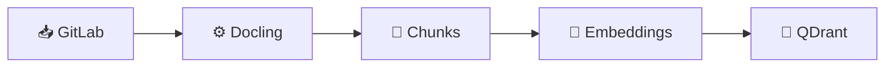

# 🚀 NIC ETL Pipeline

Bem-vindo ao **Núcleo de Inteligência e Conhecimento** - um sistema completo de ETL para processamento inteligente de documentos.

## ⚡ Executar Pipeline

<form action="/api/v1/pipelines/gitlab-qdrant/run" method="get" style="margin: 2rem 0;">
    

        Inicie o processamento completo do pipeline ETL:
    

    <button type="submit" name="action" value="run_pipeline">
        ▶️ Executar Pipeline ETL
    </button>
</form>

---

## 📊 Status Atual

    
🔄 Carregando status...

---

## 🏗️ Arquitetura do Sistema

O NIC ETL é construído com uma **arquitetura modular** baseada em notebooks Jupyter:

### 📋 Pipeline Completo

1. **🏗️ Fundação**: Configuração e validação do ambiente
2. **📥 GitLab**: Coleta de documentos do repositório
3. **⚙️ Docling**: Processamento e extração de conteúdo
4. **🔪 Chunks**: Segmentação inteligente de texto
5. **🧠 Embeddings**: Geração de vetores com IA
6. **💾 QDrant**: Armazenamento vetorial para busca semântica

## ✨ Características

    🔒
    
Trava Inteligente

    

        Impede execuções simultâneas com sistema de lock automático
    

    🌐
    
Background Jobs

    

        Execução independente da conexão HTTP usando nohup
    

    🧠
    
IA Embeddings

    

        Vetorização avançada com modelo BAAI/bge-m3
    

    📊
    
Monitoramento

    

        Status em tempo real via JSON e logs detalhados
    

## 🔗 Links Rápidos

- **[📊 Status Detalhado](/status)** - Monitoramento completo do pipeline
- **[🚀 Controle de Pipeline](/pipeline)** - Interface de execução
- **[📚 Documentação](/docs)** - Guias e referências
- **[🔗 API REST](/api/v1)** - Documentação OpenAPI

---

    <h3>🎯 Missão do NIC Lab</h3>
    

        Transformar documentos em conhecimento acessível através de tecnologias de IA,
        facilitando a descoberta e o compartilhamento de informações organizacionais.
    

